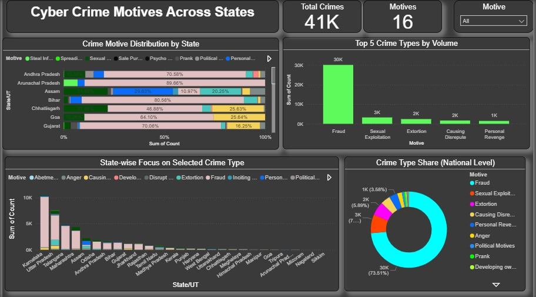
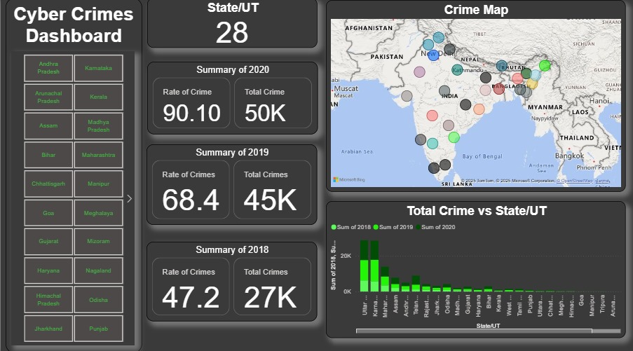

# Cybercrime Dashboard - Power BI Project

📊 A powerful and interactive Power BI dashboard analyzing **cybercrime trends in India (2018–2020)** across states, motives, gender, and arrests.

## 🔍 Overview

This project explores the **rise of cybercrime** using state-wise data. The dashboard reveals patterns, risks to vulnerable groups, and provides actionable insights to policymakers and analysts.

## 🖼️ Dashboard Pages

### 1. Cybercrime Overview
- National summary of cybercrime trends from 2018 to 2020.
- Highlights year-wise crime rates and state-wise distribution via maps and bar charts.

### 2. Crime Type Analysis
- Focuses on motives like fraud, revenge, and exploitation.
- Visuals: stacked bars, donut charts, top 5 crime types by volume.

### 3. Women & Children Safety
- Gender- and age-specific analysis.
- Women face blackmailing, defamation, and fake profiles.
- Children are targeted with cyber pornography and online game exploitation.

### 4. Arrest Statistics
- Gender-wise and state-wise distribution of cybercrime-related arrests.
- Includes maps and donut charts showing disproportionate male arrests (~98%).

### 5. Insights & Suggestions
- Key Takeaways:
  - Cybercrime nearly doubled from 2018 to 2020.
  - Fraud is the most common motive.
  - Women and children need targeted protections.
- Recommendations:
  - Digital literacy, improved reporting, forensic training for law enforcement.

## 📁 Dataset
- Source: Government open datasets (Cybercrime in India, 2023)
- Time period: 2018–2020
- Scope: All Indian States & Union Territories

## 🛠️ Tools Used
- Power BI  
- Excel  
- DAX  

## 🚀 Getting Started
Just download the `.pbix` file and open it in Power BI Desktop.

## 📸 Preview

## 🔗 Links
- 📂 [Download PBIX File](CybercrimeDashboard.pbix)
- 📰 [LinkedIn Post](https://www.linkedin.com/in/yourprofile/post-id) <!-- Replace -->
